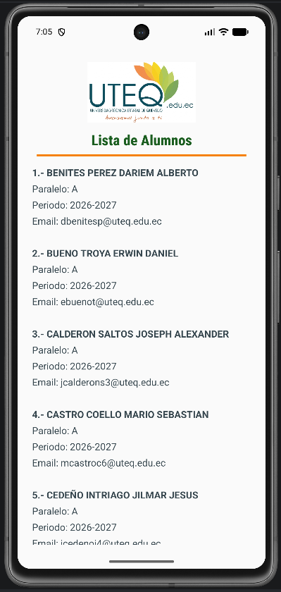

# 📱 Consumo de API RESTful con Supabase en Android

<p align="center">
  
</p>

<p align="center">
  <strong>Aplicación nativa Android que consume una API RESTful de Supabase en formato JSON</strong><br/>
  Asignatura: Desarrollo de Aplicaciones Móviles · UTEQ
</p>

---

## 📋 Descripción

Esta aplicación nativa Android desarrollada en **Kotlin** permite consumir datos desde una base de datos en **Supabase** mediante su **API RESTful en formato JSON**. La app consulta una tabla de alumnos del curso y muestra la información formateada en un `TextView` con desplazamiento.

La petición HTTP se realiza con la librería **Volley**, el JSON recibido se parsea y recorre con las clases nativas de Android (`JSONArray`, `JSONObject`), y el resultado se presenta con estilos HTML usando `Html.fromHtml()`.

---

## 🎯 Objetivos

- ✅ Crear y poblar la tabla `alumnos` en **Supabase**.
- ✅ Desarrollar una app nativa Android en **Kotlin**.
- ✅ Consumir la **API RESTful de Supabase** con cabeceras de autenticación.
- ✅ Usar **Volley** como librería HTTP para las peticiones de red.
- ✅ Parsear y recorrer el **arreglo JSON** recibido.
- ✅ Mostrar los registros de forma legible en un **TextView** con scroll.

---

## 🛠️ Tecnologías Utilizadas

| Tecnología | Versión | Propósito |
|---|---|---|
| Kotlin | 2.x | Lenguaje de programación |
| Android SDK | 37 (API 37) | Plataforma objetivo |
| Min SDK | 34 | Mínimo dispositivo compatible |
| Volley | 1.2.1 | Librería HTTP para peticiones de red |
| Supabase | Cloud | Base de datos PostgreSQL + API REST |
| Gradle | 9.4.1 | Sistema de construcción |

---

## 🗄️ Configuración de la Base de Datos (Supabase)

### Estructura de la tabla `alumnos`

| Columna | Tipo | Descripción |
|---|---|---|
| `id` | INT8 | Clave primaria autoincremental |
| `cedula` | VARCHAR | Número de cédula del alumno |
| `apellidos_nombres` | VARCHAR | Apellidos y nombres completos |
| `correo_institucional` | VARCHAR | Email `@uteq.edu.ec` |
| `correo_microsoft` | VARCHAR | Email `@msuteq.edu.ec` |
| `paralelo` | VARCHAR | Paralelo del curso (ej. `A`) |
| `periodo` | VARCHAR | Periodo lectivo (ej. `2026-2027`) |

### Script SQL para crear las columnas adicionales

Si tu tabla no tiene las columnas de `paralelo` y `periodo`, ejecuta este script en el **SQL Editor** de Supabase:

```sql
-- 1. Agregar las columnas 'paralelo' y 'periodo' a la tabla 'alumnos'
ALTER TABLE alumnos 
ADD COLUMN paralelo VARCHAR(50),
ADD COLUMN periodo VARCHAR(50);

-- 2. Establecer el paralelo 'A' y periodo '2026-2027' a todos los alumnos existentes
UPDATE alumnos 
SET paralelo = 'A', 
    periodo = '2026-2027';
```

### Configurar permisos de lectura (Deshabilitar RLS)

Para que la app pueda leer los datos sin autenticación de usuario, sigue uno de estos pasos:

**Opción A – Deshabilitar RLS (más rápido):**
1. En **Table Editor**, haz clic en los tres puntos `...` al lado de la tabla `alumnos`.
2. Selecciona **Edit table**.
3. Desactiva la casilla **Enable Row Level Security (RLS)**.
4. Guarda los cambios.

**Opción B – Crear política de lectura pública:**
1. Haz clic en **Add RLS policy** en la tabla.
2. Crea una política con operación **SELECT** y expresión `USING (true)`.

---

## ⚙️ Configuración del Proyecto Android

### 1. Clonar o abrir el proyecto

Abre el proyecto `ConsumoAPIRest` en **Android Studio**.

### 2. Configurar las credenciales de Supabase

Edita el archivo [`app/src/main/java/com/example/consumoapirest/SupabaseConfig.kt`](app/src/main/java/com/example/consumoapirest/SupabaseConfig.kt):

```kotlin
object SupabaseConfig {
    const val URL = "https://TU_PROJECT_ID.supabase.co"  // ← Tu Project URL
    const val ANON_KEY = "TU_ANON_PUBLIC_KEY"             // ← Tu Anon Key
    const val TABLE_NAME = "alumnos"                       // ← Nombre de tu tabla
}
```

> **¿Dónde encuentro estas credenciales?**
> En tu panel de Supabase: **Project Settings → API → Project URL** y **anon public key**.

---

## 🏗️ Estructura del Proyecto

```
ConsumoAPIRest/
├── app/
│   ├── src/
│   │   └── main/
│   │       ├── java/com/example/consumoapirest/
│   │       │   ├── MainActivity.kt        ← Lógica principal + Volley + parseo JSON
│   │       │   └── SupabaseConfig.kt      ← Credenciales de Supabase
│   │       ├── res/
│   │       │   ├── layout/
│   │       │   │   └── activity_main.xml  ← Diseño de la UI (logo + lista)
│   │       │   ├── drawable/
│   │       │   │   └── uteq_logo.png      ← Logotipo de la UTEQ
│   │       │   └── values/
│   │       │       ├── strings.xml        ← Recursos de texto
│   │       │       └── themes.xml         ← Tema Material 3
│   │       └── AndroidManifest.xml        ← Permiso INTERNET declarado aquí
│   └── build.gradle.kts                   ← Dependencias (Volley, etc.)
└── gradle/
    └── libs.versions.toml                 ← Catálogo de versiones
```

---

## 📦 Dependencias Clave

Declaradas en [`gradle/libs.versions.toml`](gradle/libs.versions.toml) y [`app/build.gradle.kts`](app/build.gradle.kts):

```kotlin
// build.gradle.kts
dependencies {
    implementation(libs.androidx.appcompat)
    implementation(libs.androidx.core.ktx)
    implementation(libs.androidx.constraintlayout)
    implementation(libs.material)
    implementation(libs.volley)  // ← Librería HTTP para consumir la API REST
}
```

---

## 🔑 Funcionamiento de la API REST

La app realiza una petición **GET** al endpoint de la tabla `alumnos` en Supabase:

```
GET https://<project-id>.supabase.co/rest/v1/alumnos
```

Con las siguientes **cabeceras HTTP** requeridas:

```
apikey: <SUPABASE_ANON_KEY>
Authorization: Bearer <SUPABASE_ANON_KEY>
```

### Respuesta JSON de ejemplo:

```json
[
  {
    "id": 1,
    "cedula": "1250143656",
    "apellidos_nombres": "BENITES PEREZ DARIEM ALBERTO",
    "correo_institucional": "dbenitesp@uteq.edu.ec",
    "correo_microsoft": "dbenitesp@msuteq.edu.ec",
    "paralelo": "A",
    "periodo": "2026-2027"
  },
  ...
]
```

---

## 🔧 Flujo del Código en `MainActivity.kt`

```
onCreate()
    │
    ├── Verifica credenciales en SupabaseConfig
    │        ├── Si son placeholder → showConfigurationInstruction()
    │        └── Si están configuradas → fetchAlumnosFromSupabase()
    │
    └── fetchAlumnosFromSupabase()
              │
              ├── Crea RequestQueue de Volley
              ├── Construye JsonArrayRequest con cabeceras apikey y Authorization
              ├── En éxito → displayAlumnos(JSONArray)
              │                  │
              │                  ├── Recorre el JSONArray
              │                  ├── Extrae campos (nombre, paralelo, periodo, email)
              │                  ├── Construye HTML formateado
              │                  └── setFormattedText() → Html.fromHtml() → TextView
              │
              └── En error → muestra mensaje descriptivo en el TextView
```

---

## 📱 Interfaz de Usuario

La pantalla principal (`activity_main.xml`) está compuesta por:

| Elemento | Descripción |
|---|---|
| `ImageView` | Logotipo de la UTEQ centrado en la parte superior |
| `TextView` (título) | "Lista de Alumnos" en verde institucional (`#1B5E20`) |
| `View` (divisor) | Línea decorativa en naranja (`#F57C00`) |
| `ScrollView` + `TextView` | Lista desplazable con la información de cada alumno |

---

## ▶️ Cómo Ejecutar

1. Abre el proyecto en **Android Studio**.
2. Edita `SupabaseConfig.kt` con tu URL y Anon Key de Supabase.
3. Conecta un dispositivo físico o inicia un emulador (API 34+).
4. Presiona **Run ▶** en Android Studio.

---

## 📄 Permisos Requeridos

Declarado en [`AndroidManifest.xml`](app/src/main/AndroidManifest.xml):

```xml
<uses-permission android:name="android.permission.INTERNET" />
```

Este permiso es necesario para que la app pueda realizar peticiones HTTP a la API de Supabase.

---

## 👤 Autor

Desarrollado como práctica académica de la asignatura de **Desarrollo de Aplicaciones Móviles** en la **Universidad Técnica Estatal de Quevedo (UTEQ)**.
